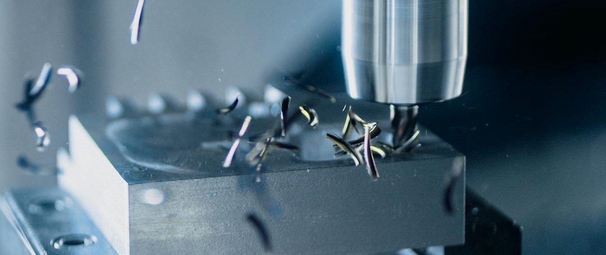

<h1>Predictive maintenance for milling machines</h1> 

Kaggle dataset: https://www.kaggle.com/datasets/stephanmatzka/predictive-maintenance-dataset-ai4i-2020  
Analysis inspired by: https://www.kaggle.com/code/zakikurdya/predictive-maintenance  

Goal: Predict machine failures of milling machines

The dataset is part of a publication from:  
S. Matzka, "Explainable Artificial Intelligence for Predictive Maintenance Applications," 2020 Third International Conference on Artificial Intelligence for Industries (AI4I), 2020, pp. 69-74, doi: 10.1109/AI4I49448.2020.00023.

The image of the milling process is the work of Daniel Smyth @ Pexels: https://www.pexels.com/de-de/foto/industrie-herstellung-maschine-werkzeug-10406128/